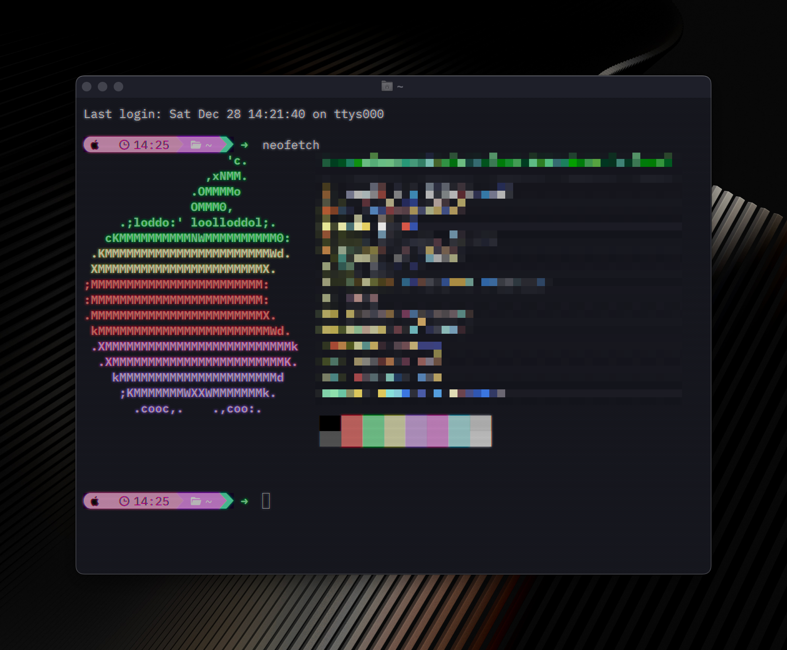

# CRT Shader with Chromatic Aberration, Glow, Scanlines, and Dot Matrix


This shader is what I use on the [Ghostty](https://github.com/ghostty-org/ghostty) terminal. It adds chromatic aberration, glow, scanlines and dot matrix for an authentic CRT look.

## Installation

### 1. Clone this repository wherever you'd like on your computer
```git
git clone https://github.com/luiscarlospando/crt-shader-with-chromatic-aberration-glow-scanlines-dot-matrix.git
```

### 2. Add the shader to your `config.txt` in Ghostty
```txt
custom-shader = /path/to/wherever/you/cloned/this/repo/crt-shader-with-chromatic-aberration-glow-scanlines-dot-matrix.glsl
```

### 3. Restart your terminal & enjoy

## 🫰 Feeling supportive?
If you feel like it, you can [buy me a coffee](https://buymeacoffee.com/luiscarlospando)! ☕

---

Made with ❤️ by [Luis Carlos Pando](https://luiscarlospando.com)
