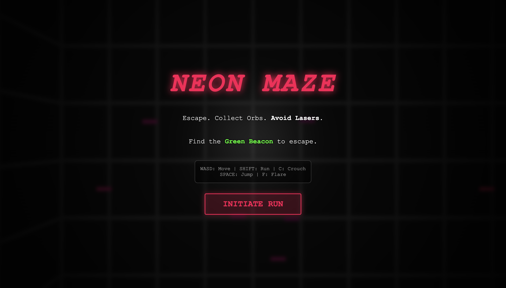
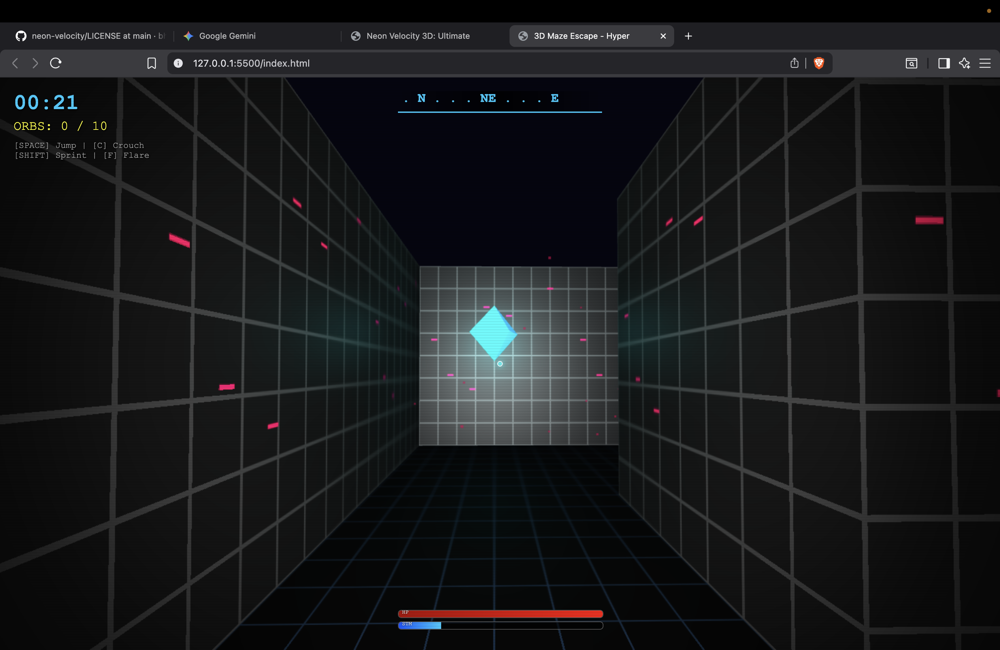
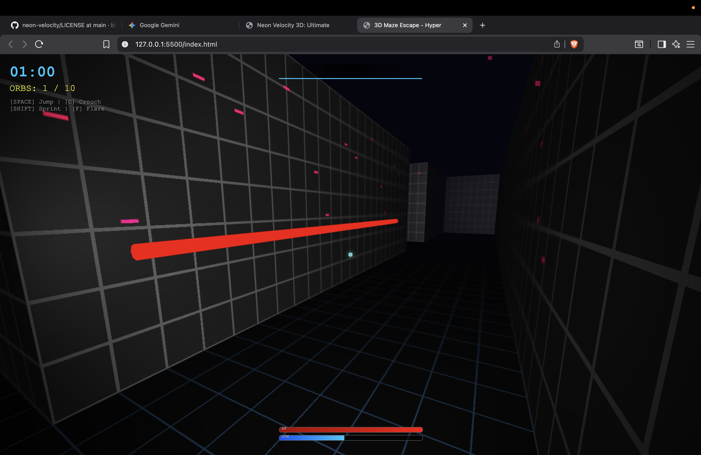
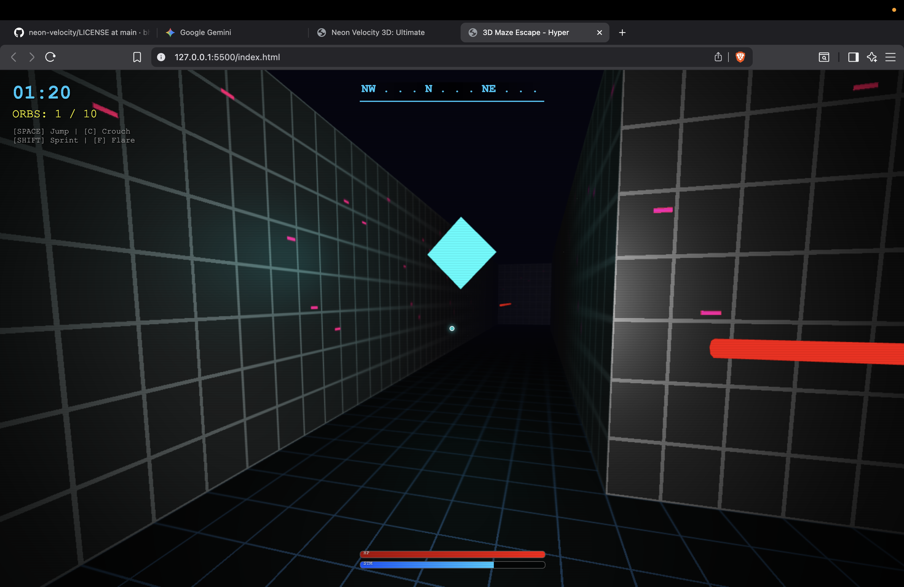

# 🎮 NEON MAZE

<div align="center">



**An immersive 3D maze escape game with cyberpunk aesthetics and intense gameplay**

[](LICENSE)
[](https://threejs.org/)
[](https://developer.mozilla.org/en-US/docs/Web/JavaScript)
[](https://bhanu2006-24.github.io/neon-maze/)

### [🚀 **PLAY THE GAME NOW** 🚀](https://bhanu2006-24.github.io/neon-maze/)

[Features](#-features) • [Controls](#-controls) • [Installation](#-getting-started) • [License](#-license)

</div>

---

## 🌟 Overview

**Neon Maze** is a high-octane, first-person 3D maze escape game built with pure vanilla JavaScript and Three.js. Navigate through procedurally generated labyrinths, collect glowing orbs, avoid deadly laser traps, and find the green beacon to escape!

With its stunning cyberpunk aesthetics featuring neon glows, particle effects, scanline filters, and dynamic lighting, Neon Maze delivers an immersive retro-futuristic gaming experience right in your browser.

---

## ✨ Features

### 🎯 Gameplay Mechanics
- **Procedurally Generated Mazes** - Every playthrough offers a unique maze layout
- **Collectible Orbs** - Gather 10 cyan orbs scattered throughout the maze to boost your score and health
- **Laser Hazards** - Crouch under deadly red laser beams or take damage
- **Health & Stamina System** - Manage your resources carefully to survive
- **Sprint & Crouch** - Use stamina wisely to sprint faster or crouch under obstacles
- **Flare System** - Deploy flares to illuminate dark corners and plan your route

### 🎨 Visual Excellence
- **Cyberpunk Aesthetic** - Neon pink, cyan, and green color palette with retro-futuristic vibes
- **Dynamic Lighting** - Atmospheric fog, point lights, and spotlight effects
- **Particle System** - 1500+ floating particles create an immersive environment
- **Scanline Effect** - CRT-style visual overlay for authentic retro feel
- **Smooth Animations** - Fluid character movement and rotating collectibles

### 🎵 Audio Design
- **Procedural Sound Effects** - Web Audio API generates dynamic sounds
- **Spatial Audio** - Context-aware audio feedback for jumps, collects, and damage
- **No External Assets** - All audio generated in real-time

---

## 📸 Screenshots

<div align="center">

| Gameplay | Maze Navigation | Laser Hazards |
|----------|----------------|---------------|
|  |  |  |

| Orb Collection | Exit Beacon |
|----------------|-------------|
|  |  |

</div>

---

## 🎮 Controls

### Movement
| Key | Action |
|-----|--------|
| `W` / `↑` | Move Forward |
| `S` / `↓` | Move Backward |
| `A` / `←` | Move Left |
| `D` / `→` | Move Right |
| `Mouse` | Look Around |

### Actions
| Key | Action |
|-----|--------|
| `SHIFT` | Sprint (drains stamina) |
| `C` / `CTRL` | Crouch (avoid lasers) |
| `SPACE` | Jump |
| `F` | Deploy Flare |

### Game
| Action | Description |
|--------|-------------|
| **Click "INITIATE RUN"** | Start the game |
| **ESC** | Pause / Exit pointer lock |

---

## 🚀 Getting Started

### Prerequisites
- A modern web browser (Chrome, Firefox, Safari, Edge)
- No additional dependencies or build tools required!

### Installation

1. **Clone the repository**
   ```bash
   git clone https://github.com/bhanu2006-24/neon-maze.git
   cd neon-maze
   ```

2. **Open the game**
   - Simply open `index.html` in your web browser
   - Or use a local server for best performance:
     ```bash
     # Python 3
     python -m http.server 8000
     
     # Python 2
     python -m SimpleHTTPServer 8000
     
     # Node.js
     npx serve
     ```

3. **Play!**
   - Navigate to `http://localhost:8000` (if using a server)
   - Click "INITIATE RUN" to start your escape

---

## 🎯 Game Objectives

1. **Survive** - Manage your health and stamina carefully
2. **Collect All Orbs** - Find all 10 cyan orbs to maximize your score
3. **Avoid Lasers** - Crouch under red laser beams to prevent damage
4. **Find the Exit** - Locate the glowing green beacon to escape
5. **Beat Your Time** - Complete the maze as quickly as possible

> **Pro Tip:** Collecting orbs restores 10 health points each!

---

## 🛠️ Technology Stack

- **Three.js (r128)** - 3D graphics rendering
- **Vanilla JavaScript (ES6+)** - Game logic and mechanics
- **Web Audio API** - Procedural sound generation
- **HTML5 Canvas** - Procedural texture generation
- **CSS3** - UI styling and effects
- **Pointer Lock API** - First-person camera controls

---

## 🎨 Technical Highlights

### Maze Generation
- Recursive backtracking algorithm for perfect maze generation
- Guaranteed path from start to exit
- 25x25 grid with procedural wall placement

### Physics System
- Custom collision detection with AABB (Axis-Aligned Bounding Box)
- Gravity simulation with jump mechanics
- Velocity-based movement with smooth deceleration

### Rendering Optimizations
- Fog-based culling for improved performance
- Efficient geometry instancing for maze walls
- Shadow mapping for realistic lighting

---

## 📝 License

This project is licensed under the **MIT License** - see the [LICENSE](LICENSE) file for details.

```
Copyright (c) 2025 Bhanu Pratap Saini
```

---

## 🤝 Contributing

Contributions, issues, and feature requests are welcome!

1. Fork the repository
2. Create your feature branch (`git checkout -b feature/AmazingFeature`)
3. Commit your changes (`git commit -m 'Add some AmazingFeature'`)
4. Push to the branch (`git push origin feature/AmazingFeature`)
5. Open a Pull Request

---

## 🌟 Acknowledgments

- **Three.js Community** - For the amazing 3D library
- **Procedural Generation Techniques** - Inspired by classic maze algorithms
- **Cyberpunk Aesthetics** - Influenced by retro-futuristic design

---

## 📬 Contact

**Bhanu Pratap Saini**

- GitHub: [@bhanu2006-24](https://github.com/bhanu2006-24)
- Project Link: [https://github.com/bhanu2006-24/neon-maze](https://github.com/bhanu2006-24/neon-maze)
- Live Demo: [https://bhanu2006-24.github.io/neon-maze/](https://bhanu2006-24.github.io/neon-maze/)

---

<div align="center">

**Made with 💙 and Three.js**

*Escape the Maze. Collect the Orbs. Survive.*

</div>
